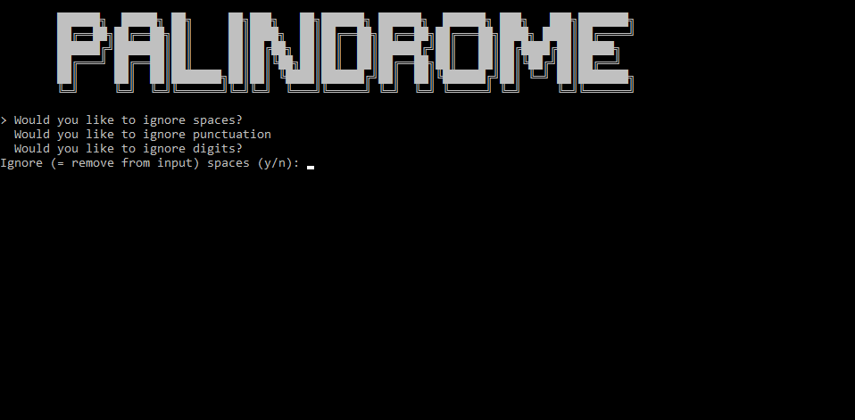

*last updated on November 7, 2024 - Python 3.10.2*

# ZUPAlindrome, or not? v1.0 - Just reverse that string!
Did you know that some words could be read backwards, and still be the same word? And that it happens to sentences, too? That's right! That's what a palindrome is!

What the program does for you (for free, again, and again...):
- Allows you to choose what you want to be ignored: spaces / punctuation (! , . etc.) / digits (1 2 3 etc.)
- Allows you to add more than a word or sentence
- Makes you coffee for free if you enter the Konami code at the right moment (within 0.5 second). Don't check the source code, I know Magic.
- Allows you to output "and" after "hundred" (English way) or without (American way)
- Allows infinite numbers, provided you add more units ("million", "billion" etc.) by editing the script. The opposite is also true: you can limit the input by removing the units from the list. Right now it's up to 999 decillion. I based that from the current balance on my bank account.

What the program does not do for you:
- Negative numbers (because you know, you just need to add "-", pronounced "minus", so...)
- Tell you where your typo is (it does a little because I'm generous)
- Your morning coffee
- And much, much more

# Preview

# Pre-requisites
- Python (3.10.2+)
- A word to be checked
- The *.bat file is to quickly launch the script on Windows.
